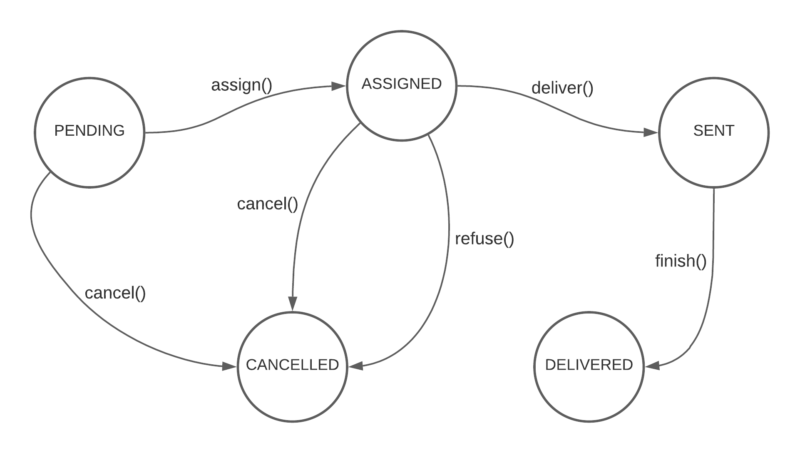
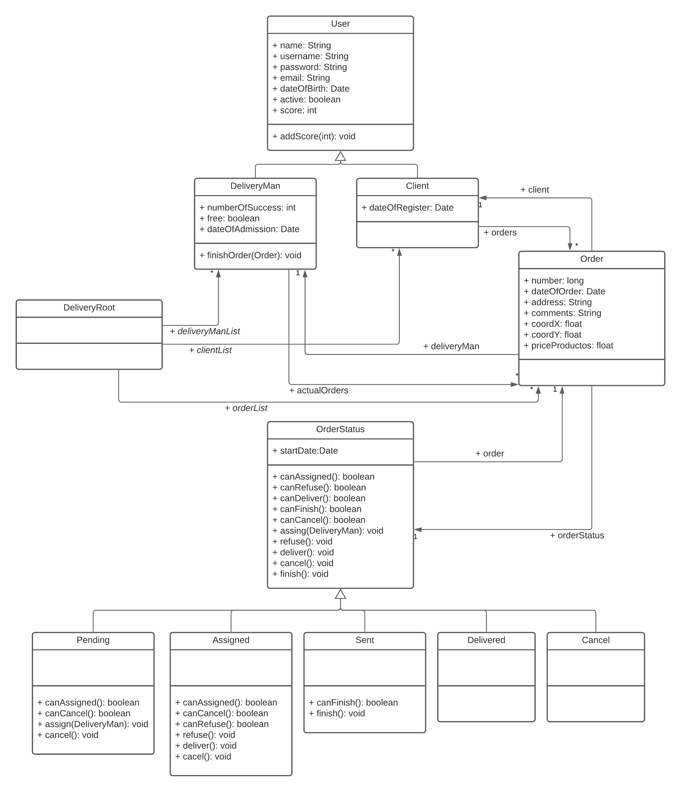

# Delivery
#### Diseño de bases de datos - MG IS 2021

Con el objetivo de ejercitar la persistencia de objetos en bases de datos relacionales, se entrega el siguiente proyecto, que se encuentra completamente desarrollado y funcional pero no persiste ninguno de los objetos que utiliza, por lo que la consigna consiste en completar este proyecto para que implemente la correspondiente persistencia en una base de datos MySQL. Además, se debe realizar la configuracion de conexion.

El proyecto fue desarrollado con las siguientes herramientas que debera tener instaladas de manera local para poder correrlo:

* Java 8
* Maven
* MySQL (5.7 en adelante)

Puede utilizar la guia que se encuentra publicada en Ideas para instalar las herramientas anteriores.

## Aplicacion

La aplicacion consiste en una sencilla API REST de un sistema de deliverys. Se poseen usuarios (User) que pueden ser de tipo cliente (Cliente), que son aquellos usuarios que realizan los pedidos, o de tipo repartidor (DeliveryMan), quienes se encargan del reparto. Los pedidos (Order) poseen, ademas de sus datos basicos, como direccion, fecha, precio, etc., un estado actual (OrderState), que ira cambiando a medida que este avanza. Este estado, ademas, definira el comportamiento del pedido en diferentes situaciones. 

Inicialmente el estado del pedido sera pendiente (Pending). Una vez confirmado por el cliente, el pedido se asigna a un repartidor libre (Assigned), quien puede rechazar el pedido e inmediatamente el pedido se cancela (Cancelled) o puede aceptar y comenzar el traslado del pedido, en cuyo caso el pedido pasa a un estado de en progreso (Sent). Una vez entregado, el pedido pasa a un estado de finalizado (Finished). Antes de que el pedido fuera aceptado por el repartidor, este puede ser cancelado por el cliente, llevandolo a un estado de cancelado (Cancelled). El siguiente diagrama muestra de una manera grafica la transicion entre estados de un pedidio.

Además, se lleva un sistema de puntos para cada usuario. Un cliente suma 1 punto por cada pedido finalizado, mientras que resta 1 punto cuando cancela un pedido sin confirmar y 2 puntos cuando cancela un pedido ya confirmado y asignado. Un repartidor suma 1 punto cuando completa una entrega, mientras que resta 2 puntos cuando rechaza un pedido. 

El sistema implementa dos patrones conocidos. El primero de ellos, ya visto durante las teorias, es el root-object mediante la clase DeliveryRoot. El restante es el patron State, que se utiliza para modelar la transicion de estados de un pedido. Si no cononce este segundo patron, la siguiente pagina explica de una manera simple el patron State: https://refactoring.guru/es/design-patterns/state 

A continuacion dejamos un digrama de clases del sistema de deliverys:

## Configuracion

Para poder persistir los objetos debera configurar la conexion con la base de datos, para ello le dejamos algunos tips:

* Las dependencias necesarias (conector de mysql y JPA) se encuentran ya agregadas al archivo POM.xml, pero se encuentran comentadas. Debera descomentarlas.
* Debera configurar la conexion a su base de datos MySQL local, para ello le recomendamos utilzar las applications.propierties tal como se hizo en el proyecto de entrega (puede guiarse por este).
* No se olvide de crear el esquema de base de datos de manera manual.

## Actividad

La aplicacion de delivery se encuentra ya completamente funcional y con sus endpoints desarrollados, se debera añadirle a esta la persistencia de objetos. Le dejamos listados algunas consideraciones:

* El modelo tiene una jerarquia de clases, recuerde que existen diferentes maneras de mapear una jerarquia, como se vio en la teoria.
* Un pedido tiene un estado, modelado como una clase que puede ir cambiando (state pattern), piense e implemente una estrategia de mapeo para guardar dicho estado.
* Al implemetar persistencia, piense que funcion pasa a tener la clase DeliveryRoot (root-object pattern).

Este trabajo no debera entregarlo, sino que se trata de un proyecto adicional. Se discutirá la solucion en la proxima clase practica. 
